# Long Story Short — implementation architecture

Status: **accepted for MVP implementation**.

## Architectural principles

1. **Typed state is authoritative.** Agents exchange versioned Pydantic artifacts through
   LangGraph state, not conversational history or filesystem side channels.
2. **Agents propose; deterministic code decides.** Models create concepts, formal
   specifications, prose, and critiques. Z3 and the causal simulator decide consistency,
   entailment, uniqueness, interventions, proof validity, and falsification.
3. **The complete world precedes disclosure.** The pipeline validates what happened before
   choosing what the reader is told.
4. **Every stage has a narrow interface.** Creative planning, formalization, solving,
   evidence selection, prose rendering, and critique are separate modules with schema-defined
   handoffs.
5. **Failures are data.** Rejected attempts, repairs, and critic disagreements are retained
   with provenance.
6. **MVP orchestration is explicit.** Use a LangGraph `StateGraph`, not a Deep Agent
   supervisor. Dynamic delegation is unnecessary for a fixed auditable pipeline.
7. **Offline logic is testable without secrets.** Provider calls sit behind injected model
   adapters; schemas, solver behavior, routing, and artifact persistence use fakes in tests.

## Runtime topology

```mermaid
flowchart LR
    Recipe[RecipeSampler] --> Concept[ConceptPlanner]
    Concept --> ConceptGate[ConceptCritic]
    ConceptGate -->|"revise, max 2"| Concept
    ConceptGate -->|accept| Formalizer[WorldFormalizer]
    ConceptGate -->|reject| Rejected[RejectedRun]
    Formalizer --> WorldCheck[WorldSolver]
    WorldCheck --> Evidence[EvidencePlanner]
    Evidence --> DisclosureCheck[VisibleTheorySolver]
    DisclosureCheck --> Outline[OutlinePlanner]
    Outline --> Scenes[SceneWriter]
    Scenes --> Assembly[StoryAssembler]
    Assembly --> StoryGate[BlindStoryCritic]
    StoryGate --> Questions[QuestionRenderer]
    Questions --> FinalGate[FinalValidator]
    FinalGate -->|accept| Accepted[AcceptedItem]
    FinalGate -->|reject| Rejected
    Accepted --> Artifacts[ArtifactStore]
    Rejected --> Artifacts
```



The graph uses conditional edges for repair, rejection, and completion. Nodes return partial
state updates. No node mutates an artifact already accepted by an earlier deterministic gate;
a repair produces a new version linked to the previous attempt.

## Package map

```text
src/cogito_mill/
  config/
    settings.py              # Existing env-backed provider settings
  llm/
    providers.py             # Existing Azure/GLM writer/judge factories
    protocol.py              # Injectable structured-output model interface
  domain/
    recipe.py                # Generation recipe and requested difficulty
    concept.py               # Concept proposal and hard-gate critique
    world.py                 # Entities, relations, time, events, rules
    evidence.py              # Visible theory, clue channels, distractors
    reasoning.py             # Claims, proof steps, counterfactuals, falsifiers
    narrative.py             # Outline, scenes, sentence-addressable story
    questions.py             # Question bundle and canonical answers
    run.py                   # Status, failure, attempt, manifest, provenance
  reasoning/
    solver.py                # Small public interface for deterministic analysis
    z3_compiler.py           # Relational and temporal constraints
    causal.py                # Preconditions/effects/inhibitors and interventions
    proof.py                 # Supports, typed steps, strategy and falsifier extraction
  agents/
    prompts/                 # Versioned role prompts
    concept.py               # Concept planner and critic adapters
    formalizer.py            # World formalizer
    evidence.py              # Evidence/disclosure planner
    narrative.py             # Outline and scene writers
    critics.py               # Blind prose and final-item critics
    questions.py             # Trace verbalizer and question renderer
  pipelines/
    state.py                 # MillState
    nodes.py                 # Pure-ish graph node functions
    routing.py               # Deterministic conditional-edge decisions
    graph.py                 # StateGraph construction/compilation
    artifacts.py             # Filesystem artifact adapter
    runner.py                # One-item invocation interface
  validation/
    schema.py                # Cross-artifact structural checks
    grounding.py             # World/evidence/story alignment
    final.py                 # Acceptance policy
  datasets/
    __init__.py              # Existing Hub naming helper; publishing deferred
  cli.py                     # One-item local/cloud entry point
```

The exact file split may be collapsed where a module would otherwise be shallow. The stable
seams are the domain schemas, deterministic solver interface, model interface, graph runner,
and artifact store.

## Domain model

### GenerationRecipe

The recipe is sampled by code and constrains, rather than scripts, the planner:

- required reasoning types: relational, temporal, causal;
- requested structural difficulty axes;
- setting family;
- required question types;
- clue and distractor mix;
- forbidden shortcuts;
- provider family, seed, and prompt/schema versions.

Difficulty is initially a requested target plus raw structural metadata. MVP does not reject
items against calibrated difficulty thresholds.

### WorldSpec

`WorldSpec` is the complete hidden deterministic world:

- `Entity`: stable ID, type, attributes, and allowed natural renderings;
- `Relation`: typed arguments and declared properties such as inverse, symmetry,
  cardinality, exclusivity, or transitivity;
- `TimePoint` and `TimeInterval`: exact or relative constraints, duration, ordering, and
  overlap;
- `Event`: participants, interval, preconditions, effects, inhibitors, and causal parents;
- `Rule`: explicit local deterministic rule;
- `TargetClaim`: canonical predicate and expected truth value;
- `Intervention`: event/fact replacement used for a counterfactual.

Pydantic validates local shape and references. The solver validates global consistency.

### VisibleTheory

`VisibleTheory` is a projection of `WorldSpec` containing only facts and rules available to
the reader. Each disclosed fact has:

- a stable fact ID;
- formal semantics;
- clue channel (`statement`, `observation`, `record`, `physical_state`,
  `rule_application`);
- intended scene and reveal order;
- role (`required`, `distractor`, `red_herring`, `context`);
- source sentence IDs after rendering.

The solver checks the target over every model satisfying this theory. Acceptance requires
exactly one entailed answer.

### Reasoning artifacts

`DeductionStep` contains:

- step ID;
- evidence fact/sentence IDs;
- prior-step IDs;
- controlled inference type;
- canonical conclusion;
- optional concise explanation.

The canonical successful trace is extracted from the solver's proof dependencies and only
then verbalized. The data does not use the planner's private rationale as gold.

`Falsifier` contains the supplied hypothesis and a minimal contradictory fact/constraint set.
`Counterfactual` contains the intervention, recomputed world result, target claim, and answer.

### Narrative and questions

The narrative model preserves:

- outline sections and evidence-placement obligations;
- per-scene fact ledger;
- generated scene versions and repair history;
- assembled sentence-addressable prose;
- mapping from visible fact IDs to sentence IDs.

The question bundle stores a canonical answer independently from supported conclusions and
typed reasoning. This keeps exact answer scoring possible without discarding deeper process
checks.

## Solver module

The reasoning package is a deep module with one primary interface:

```python
class WorldSolver(Protocol):
    def analyze_world(self, world: WorldSpec) -> WorldAnalysis: ...
    def analyze_disclosure(
        self,
        world: WorldSpec,
        visible: VisibleTheory,
        target: TargetClaim,
    ) -> DisclosureAnalysis: ...
```

Its implementation:

1. compiles relational, identity, cardinality, and temporal constraints to Z3;
2. checks satisfiability and reports an unsat core where possible;
3. proves the intended target;
4. negates candidate answers to establish uniqueness over the visible theory;
5. simulates deterministic causal interventions;
6. extracts a minimal sufficient support set;
7. builds a canonical typed successful proof;
8. extracts a minimal falsifier for a supplied false hypothesis;
9. classifies materially different proof strategies.

Step ordering differences do not constitute different strategies. A different support
mechanism or inference family does. The first implementation may use conservative rejection
when strategy equivalence cannot be established.

## Agent roles

| Role | Model role | Input | Output | May decide |
|------|------------|-------|--------|------------|
| Concept planner | writer | Recipe, prior critique | Concept brief | Creative premise only |
| Concept critic | judge | Recipe, concept | Hard-gate report | Accept/revise/reject concept |
| World formalizer | writer | Accepted concept, schemas | WorldSpec | Proposed formal world |
| Evidence planner | writer | Valid world, proof support | VisibleTheory | Proposed disclosure |
| Outline planner | writer | World, visible theory | Outline and clue placement | Narrative structure |
| Scene writer | writer | Scene obligations, fact ledger | Scene prose | Surface realization |
| Story critic | judge | Story, visible theory, rubric | Grounding report | Recommend repair/quarantine |
| Trace verbalizer | writer | Solver proof | Explanatory text fields | Wording only |
| Question renderer | writer | Solver-derived targets | Question bundle wording | Wording only |
| Final critic | judge | Complete rendered item | Final critic report | Recommend accept/quarantine |

The critic is blind to free-form generator rationale. It may see formal artifacts needed to
check grounding. Deterministic validation outranks model opinion. Disagreement between the
critic and deterministic result quarantines the item for later human adjudication.

## Provider selection

Each run selects exactly one family:

- Azure: writer deployment for generation roles, judge deployment for critic roles;
- GLM: writer model for generation roles, judge model for critic roles.

The run does not mix provider families. Cross-provider comparison occurs across separate runs.
Every artifact records provider, deployment, role, prompt version, schema version, and model
response metadata without credentials.

## Repair and failure semantics

- Concept: initial proposal plus at most two critic-guided revisions.
- Later stages: bounded stage-local repair using structured validation errors; default limit
  is configurable in the run recipe.
- A repair cannot edit an earlier validated artifact in place. If an upstream artifact must
  change, the graph invalidates and regenerates downstream artifacts.
- Exhausted repair, schema failure, solver failure, unresolved grounding mismatch, or critic
  disagreement produces `rejected` or `quarantined`, never silent acceptance.
- Provider transport failures use limited retry with backoff and are distinguished from
  content repair attempts.

## Artifact storage

The filesystem adapter writes atomically to a run directory:

```text
data/
  raw/<run_id>/
    manifest.json
    recipe.json
    attempts/
      01-concept/
      02-formalizer/
      ...
  interim/<run_id>/
    world.json
    world-analysis.json
    visible-theory.json
    disclosure-analysis.json
    outline.json
    scenes/
    story.json
    critic-reports/
    questions.json
  processed/<run_id>/
    reasoning-item.json
    acceptance-report.json
```

Rejected runs remain under `raw`/`interim` with terminal status and reasons. Promotion to
`processed` occurs only after final acceptance. Writes use temporary files/directories followed
by atomic replacement. No secret or raw settings object is serialized.

## Tests

| Layer | Runs without secrets | Coverage |
|-------|----------------------|----------|
| Unit | yes | Pydantic invariants, Z3 compiler, causal simulation, proofs, falsifiers, mappings, artifact writes |
| Integration | yes | LangGraph routing, repair exhaustion, invalidation, fake structured model adapters, Azure/GLM role selection |
| E2E fixture | yes | Handwritten world through deterministic and fake-agent pipeline |
| E2E live | no | One real provider-family run; opt-in and cloud-secret gated |

Tests and callers cross the same solver, model, runner, and artifact-store interfaces. Live
model responses are never required for the default unit or integration suite.
